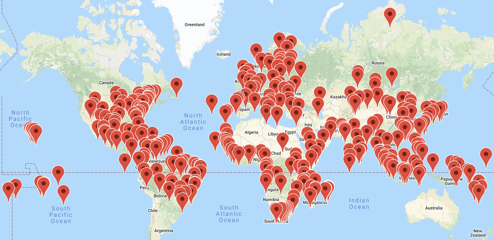
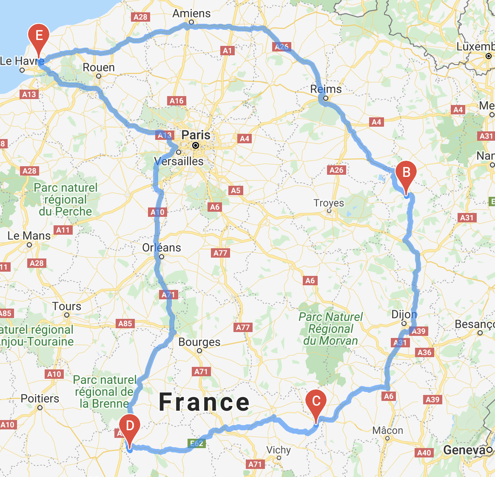
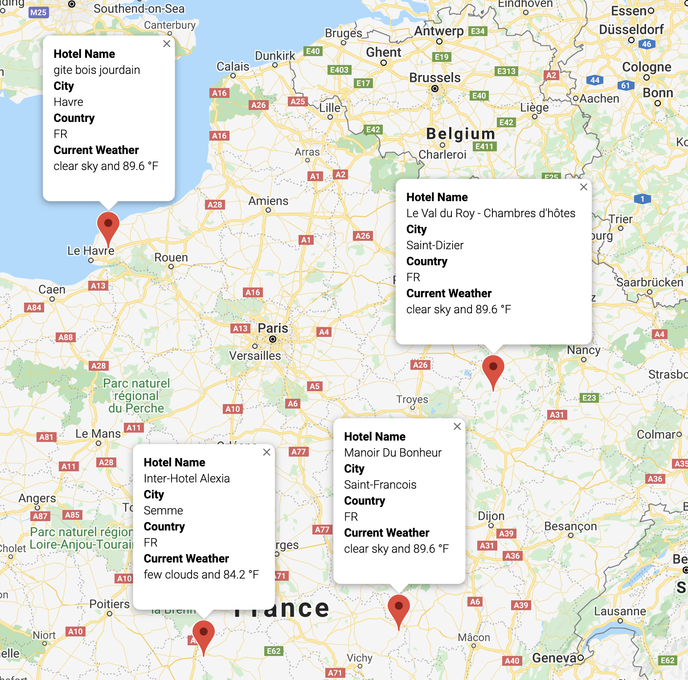

# Detailed Instructions From Your Instructor Team

NOTE: You will want to work with gmaps API in the classic version of jupyter notebook. You can access this from jupyter lab from the help menu and launch clasic notebook.

The objective of this challenge is for you to  build on your Python API programming skills, writing input statements, decision statements, logical expressions, and use the Pandas `loc` method and `concat()` function to create marker layer and directions layer Google maps.

## Deliverable 1: Retrieve Weather Data

For the first deliverable, we are asking you to create a new set of 2,000 random latitudes and longitudes and get the nearest city using the `citypy` module. Using your  OpenWeatherMap API key, you'll retrieve all the weather data you retrieved in the module plus the weather description. You'll then add all the data to a DataFrame and export the DataFrame into the "Weather_Database" folder as `WeatherPy_Database.csv`.

The DataFrame should look similar to the following:

## Deliverable 2: Create a Customer Travel Destinations Map

For the second deliverable, you will need to filter the `WeatherPy_Database.csv` on the minimum and maximum temperature preferences to identify potential travel destinations. Then you'll need to find nearby hotels using the Google Maps and Places API. After you add the hotel to the DataFrame you'll export the DataFrame into the "Vacation_Search" folder as `WeatherPy_vacation.csv`, and then show those destinations on a marker layer map with pop-up markers.

For this part of the challenge we have provided [Vacation Search starter code](Vacation_Search_starter_code.ipynb) that has comments as to where you will need to add code to complete this part of the challenge.

You should be familiar with many of the steps for this part of the challenge since most of the steps have been covered in the module. After you add the hotel name to the `hotel_df` DataFrame you will need to drop the rows in the DataFrame where there is no hotel name retrieved from the Google Places API.

## Deliverable 3: Create a Travel Itinerary Map

For the third deliverable, we are asking you to create a travel route itinerary using the Google "Directions API". From the filtered cities in `WeatherPy_vacation.csv` file you will need to select four cities to travel to and then create a directions layer map. Then you'll create a marker layer map with a pop-up marker for each city on the itinerary.

For this part of the challenge we have provided [Vacation Itinerary starter code](Vacation_Itinerary_starter_code.ipynb) that has comments as to where you will need to add code to complete this part of the challenge. Here is an overview of what you need to do:

* you will need to enable the "Google Directions API" on your account before you get started.
* In Steps 1-4, you'll need to read the `WeatherPy_vacation.csv` file into a DataFrame, then you'll create a marker layer map.
* From the map, you'll need pick four cities, preferably in the same country, for the route.
* In Step 5, using the variables we have provided you'll need to create four separate DataFrames using the `loc` method for each city on the travel route. The staring city will also be the ending city with three stops on the route.
* In order to map the cities on a directions layer map, you'll have to retrieve the latitudes and longitudes from all four cities. In Step 6, you'll need to write code to retrieve the latitude-longitude pairs as tuples from each city DataFrame using the `to_numpy()` function and list indexing. We have provided a hint that shows documentation on how to use the `to_numpy()` function.
* In Step 7, you will then have to use the [gmaps documentation](https://jupyter-gmaps.readthedocs.io/en/latest/tutorial.html#directions-layer) to create a directions layer map using the variables from Step 6, where the starting and ending city are the same city, the `waypoints` are the three other cities, and the `travel_mode` is either, `DRIVING`, `BICYCLING`, or `WALKING` to create the travel route.
* In Step 8, you'll need to combine the four separate DataFrames for each city using the `concat()` function. We have provided a code snippet, `itinerary_df = pd.concat([], ignore_index=True)` and a hint that shows documentation on how to use the `concat()` function.
* Finally, in Steps 9-11, we are asking them to create a marker layer map with a pop-up marker for each city you on the route.

* **Note:** Make sure you *do not* include your `config.py` file with your submission.

Challenge repositories should contain the following:

**A Readme File**

* Even though there is not a written analysis for this challenge to be graded, you should add a brief description of your project.

**Weather Database Folder**

* The "Weather_Database" folder should have:

  * The `Weather_Database.ipynb` file that has all the code used to create the new DataFrame with the weather description.

  

  * The `WeatherPy_Database.csv` file.

**Vacation Search Folder**

* The "Vacation_Search" folder should have:

  * The `Vacation_Search.ipynb` file that has all the code used to create the vacation DataFrame with hotel information based on the user inputs and the maps.
  * The `WeatherPy_vacation.csv` file.
  * The `Vacation_Destination_Map.png` map.

  

  * The `Vacation_Destination_Markers.png` map that has pop-up markers for each city.

  

**Vacation Itinerary Folder**

* The "Vacation_Itinerary" folder should have:

  * The `Vacation_Itinerary.ipynb` file that has all the code used to create the travel route between four cities and the maps.
  * The `Vacation_travel_map.png` with travel route.

  

  * The `Vacation_travel_map_markers.png` map with pop-up markers.

  

## Grading Rubric

The [WeatherPy Grading Rubric](Module_6_Challenge_Grading_Rubric.pdf) is provided for you to use when grading you' submissions.
